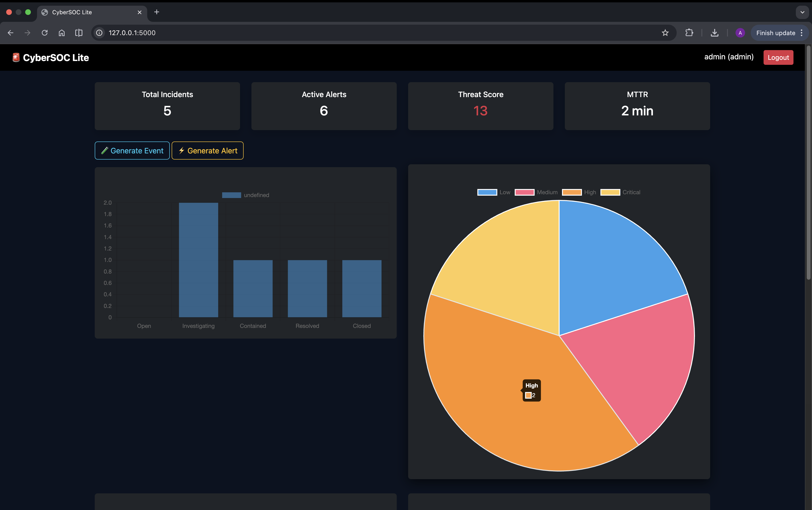
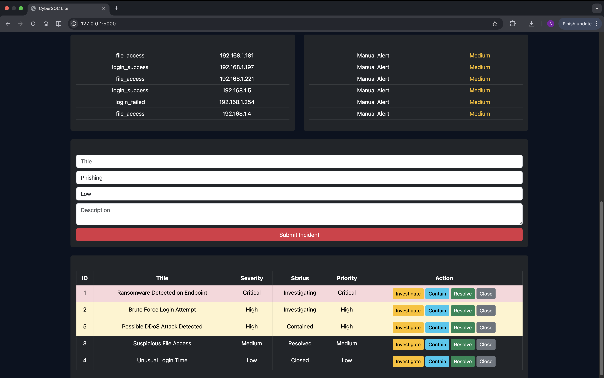
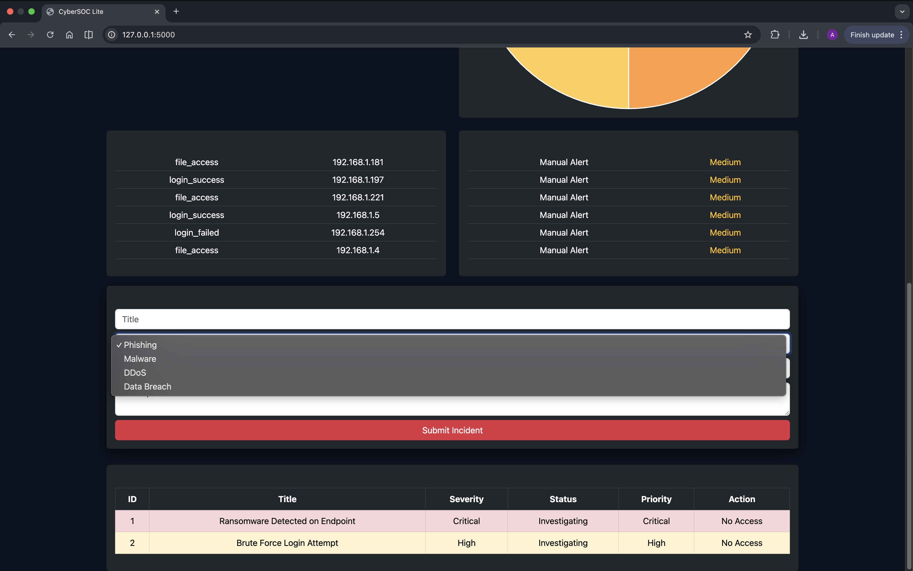

# 🚨 CyberSOC Lite

A SOC (Security Operations Center) simulation dashboard that mimics real-world cybersecurity detection and response workflows.

---

## 🔥 Key Features

- Event → Alert → Incident pipeline  
- Rule-based detection (e.g., brute-force attacks)  
- Automatic alert-to-incident conversion (XDR-style workflow)  
- Role-based access control (Admin / Analyst / User)  
- Incident lifecycle management (Open → Investigating → Resolved → Closed)  
- MTTR (Mean Time to Resolve) tracking  
- Threat scoring & prioritization system  
- Interactive dashboard with real-time charts  

---

## 🧠 Tech Stack

- Python (Flask)
- SQLite
- HTML, Bootstrap
- Chart.js

---

## 📸 Screenshots

### Dashboard Overview


### Incident Management (Admin)


### User View (Restricted Access)


---

## 🚀 How to Run

```bash
git clone https://github.com/Aksh230126/cybersoc-lite.git
cd cybersoc-lite

python3 -m venv venv
source venv/bin/activate

pip install -r requirements.txt

mkdir database

python app.py
